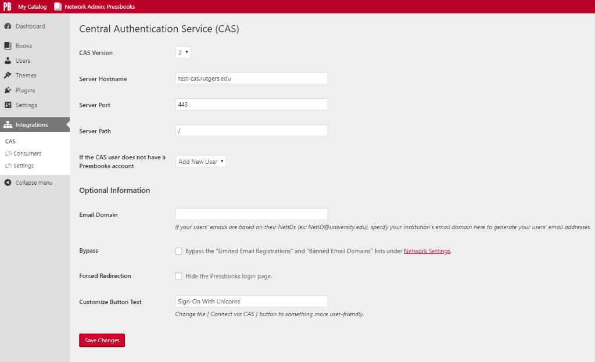

# Pressbooks CAS Single Sign-On

Contributors: conner_bw, greatislander
Tags: pressbooks, sso, cas
Requires at least: 6.0.3
Tested up to: 6.0.3
Stable tag: 2.1.0
License: GPLv3 or later
License URI: https://www.gnu.org/licenses/gpl-3.0.html

CAS Single Sign-On integration for Pressbooks.

## Description

[](https://packagist.org/packages/pressbooks/pressbooks-cas-sso) [](https://github.com/pressbooks/pressbooks-cas-sso/releases) [](https://codecov.io/gh/pressbooks/pressbooks-cas-sso)

Plugin to integrate Pressbooks with [Central AuthenticationService (CAS)](http://en.wikipedia.org/wiki/Central_Authentication_Service) single sign-on architectures.

Users who attempt to login to Pressbooks are redirected to the central CAS sign-on screen. After the user’s credentials are verified, they are redirected back to the Pressbooks
network. If we match a Pressbooks user by CAS username (stored in user_meta table), the user is recognized as valid and allowed access. If no match, then try to match a Pressbooks
user by email (and store a successful match in user_meta table for next time). If the CAS user does not have an account in Pressbooks, a new user can be created, or access can be
refused, depending on the configuration.

## Installation

```
composer require pressbooks/pressbooks-cas-sso
```

Or, download the latest version from the releases page and unzip it into your WordPress plugin directory: https://github.com/pressbooks/pressbooks-cas-sso/releases

Then, activate and configure the plugin at the Network level.

Read the integrations documentation for more info: https://docs.pressbooks.org/integrations/cas-sso/

### Security Considerations

Set the `PB_CAS_CERT_PATH` environment variable to configure validation of the CAS server. Used by `CURLOPT_CAINFO` for peer and host verification:

    putenv( 'PB_CAS_CERT_PATH=/path/to/cachain.pem' ); // Path to the CA chain that issued the CAS server certificate

### Advanced Configuration

The email can be filtered, example: `add_filter( 'pb_integrations_multidomain_email', function( $email, $uid, $plugin ) { /* Custom use case, return $email */ }, 10, 3 );`

Because this plugin uses the fabulous [apereo/phpCAS](https://github.com/apereo/phpCAS) library, [many other configuration variables can be tweaked](https://github.com/apereo/phpCAS/tree/master/docs/examples).

## Screenshots



## Changelog
### 2.1.0

* See: https://github.com/pressbooks/pressbooks-cas-sso/releases/tag/2.1.0
* Full release history available at: https://github.com/pressbooks/pressbooks-cas-sso/releases

## Upgrade Notice
### 2.0.0
* Pressbooks CAS Single Sign-On requires Pressbooks >= 6.0.0

### 1.2.4
* Pressbooks CAS Single Sign-On requires Pressbooks >= 5.34.1

### 1.2.3
* Pressbooks CAS Single Sign-On requires Pressbooks >= 5.9.1
