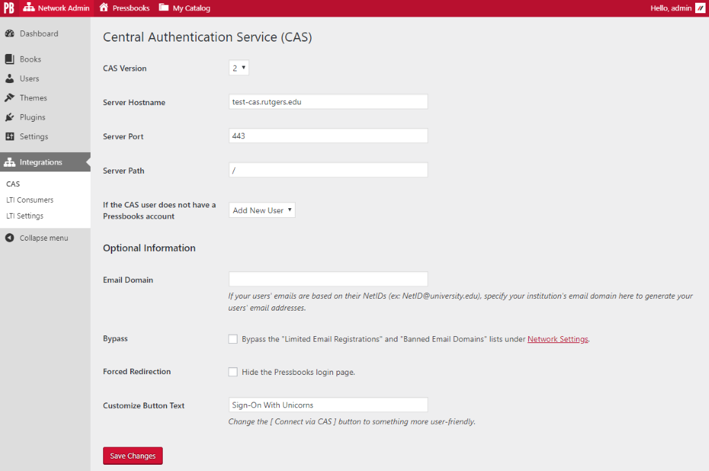

# Pressbooks CAS Single Sign-On 
**Contributors:** conner_bw, greatislander  
**Donate link:** https://opencollective.com/pressbooks/  
**Tags:** pressbooks, sso, cas  
**Requires at least:** 4.9.5  
**Tested up to:** 4.9.5  
**Stable tag:** 0.2.0  
**License:** GPLv3 or later  
**License URI:** https://www.gnu.org/licenses/gpl-3.0.html  

CAS Single Sign-On integration for Pressbooks.


## Description 

Plugin to integrate Pressbooks with [Central AuthenticationService (CAS)](http://en.wikipedia.org/wiki/Central_Authentication_Service) single sign-on architectures.

Users who attempt to login to Pressbooks are redirected to the central CAS sign-on screen. After the user’s credentials are verified, they are redirected back to the Pressbooks
network. If the CAS username matches the Pressbooks username, the user is recognized as valid and allowed access. If the CAS user does not have an account in Pressbooks, a new
user can be created, or access can be refused, depending on the configuration.


## Installation 

```
composer require pressbooks/pressbooks-cas-sso
```

Or, download the latest version from the releases page and unzip it into your WordPress plugin directory): https://github.com/pressbooks/pressbooks-cas-sso/releases

Then, activate and configure the plugin at the Network level.


## Screenshots 




## Changelog 


### 0.2.0 
* Initial release.


## Upgrade Notice 


### 0.2.0 
* Pressbooks CAS Single Sign-On requires Pressbooks >= 5.3.0 and WordPress >= 4.9.5.
